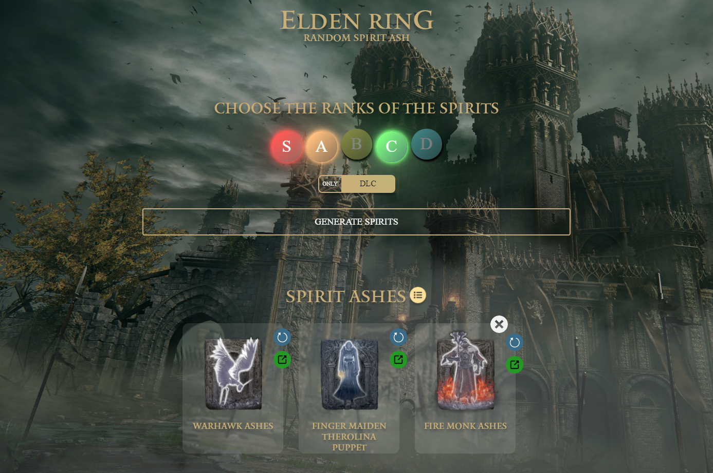
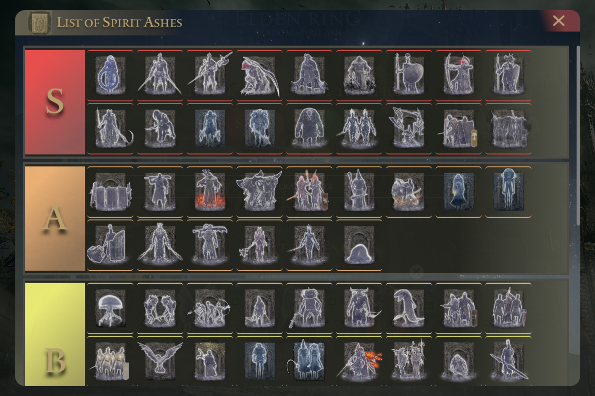

<h1 align="center">
  RandomSpiritV2
</h1>

  
  
  
  
  
  
  
  

  

  

  

  

## 💻 Project
Elden ring game random spirit generator made with React. 

## 🚀 Tecnologias
- HTML
- CSS
- Javascript
- React

  

